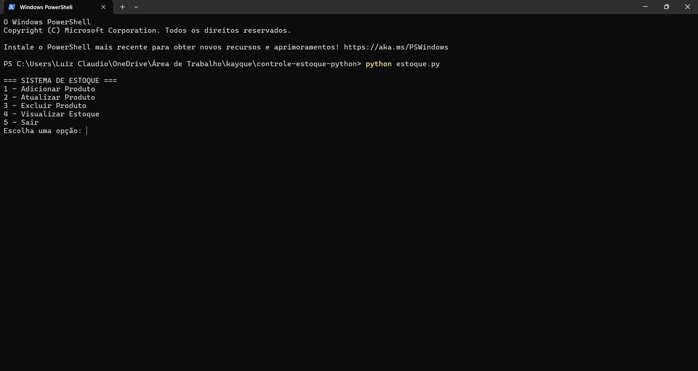

# 🧾 Controle de Estoque com Python

Sistema de controle de estoque simples desenvolvido em Python, com interface via terminal (CLI), focado na gestão de produtos de uma loja de eletrônicos.

## 🎯 Objetivo

Este projeto foi desenvolvido como parte de um estudo de lógica computacional aplicada à linguagem Python. A proposta consiste em simular um sistema funcional capaz de:

- ✅ Adicionar produtos
- ✅ Atualizar produtos existentes
- ✅ Excluir produtos
- ✅ Visualizar o estoque atual
- ✅ Sair do sistema

---

## 💻 Tecnologias Utilizadas

- [Python 3.x](https://www.python.org/)
- Terminal/Console

---

## 🚀 Como Executar o Projeto

1. Clone este repositório:
   ```bash
   git clone https://github.com/KayqueLucas/controle-estoque-python.git
   ```
2. Acesse a pasta do projeto:
   ```bash
   cd controle-estoque-python
   ```
3. Execute o arquivo Python:
   ```bash
   python estoque.py
   ```

---

## 📸 Prints do Sistema em Funcionamento

### 📌 Menu Principal
> _Adicione aqui uma imagem do menu principal_


---

### ➕ Adicionando Produto
> _Adicione aqui um print ao adicionar um novo produto_


---

### 🛠 Atualizando Produto
> _Adicione aqui um print do processo de atualização_


---

### ❌ Excluindo Produto
> _Adicione aqui um print excluindo um produto_


---

### 📦 Visualizando Estoque
> _Adicione aqui um print da listagem de produtos no estoque_


---

## 🧠 Aprendizados

Durante o desenvolvimento do projeto foram praticados conceitos como:

- Estruturas condicionais (`if`, `else`)
- Laços de repetição (`while`, `for`)
- Manipulação de dicionários
- Modularização com funções
- Tratamento de exceções
- Organização e comentários no código

---

## 📂 Estrutura do Projeto

```
controle-estoque-python/
├── imgs/                   # Imagens dos prints de tela
├── estoque.py             # Código-fonte principal
└── README.md              # Documentação do projeto
```

---

## 📄 Licença

Este projeto é de uso educacional e livre para estudo.

---

## 👨‍💻 Autor

Desenvolvido por Kayque Lucas  
[LinkedIn](https://www.linkedin.com/in/kayque-lucas-dev/)
